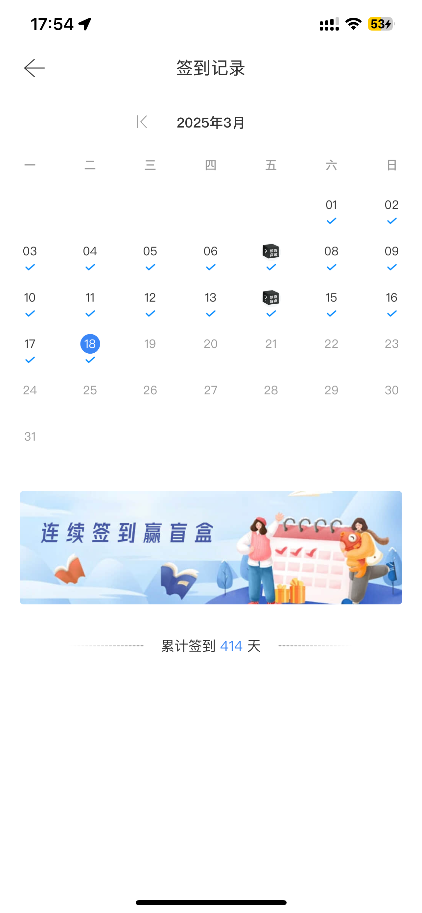
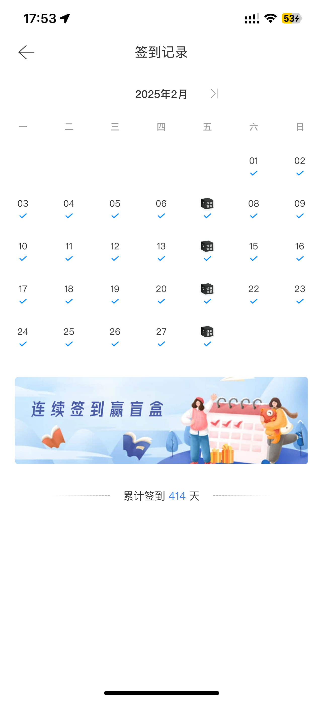

# faw-vw-auto
一汽大众定时签到获取积分，Release版本只编译了macOS（M系列芯片）环境的程序包，其他平台可自行下载编译。

    
    

## 有哪些功能
- 每日签到
- 连续签到7天，自动打开盲盒奖励；获取额外积分
- 支持Bark推送签到结果至iPhone

## 如何使用
1. 从Release里下载最新版本的`faw-vw-auto`。并解压至任意目录。
2. 配置env.yaml文件，参数如下：
- mobile: 手机号（一汽大众APP注册手机号）
- password: 密码密文（需要先用浏览器登录一下Web版的应用，然后看下https://vw.faw-vw.com/api/business/cpoint/registeOrLogin，在Request Body里就有这个参数）
- WebDid：设备ID（同上，在Request Body里的did参数）
- BarkPushServerURL：Bark推送地址（可选），这个参数是使用Bark来推送签到结果至iPhone，如果不需要推送可以不填写。

- securityCode：客户端签到接口必须参数。这个参数可以通过抓包App的登录接口（https://oneapp-api.faw-vw.com/account/login/loginByPassword/v1）获取。
- did：设备ID。这个参数是客户端应用的设备ID，可以通过抓包App的登录接口（https://oneapp-api.faw-vw.com/account/login/loginByPassword/v1）获取。

3. 运行`faw-vw-auto`， 执行命令如‘nohup ./faw-vw-auto-darwin &’，即可自动签到。

## 注意事项
- 本项目仅供学习交流使用，请勿用于商业用途。
- 因涉及账户密码，请勿将env.yaml文件上传至公共仓库，以免泄露个人信息。