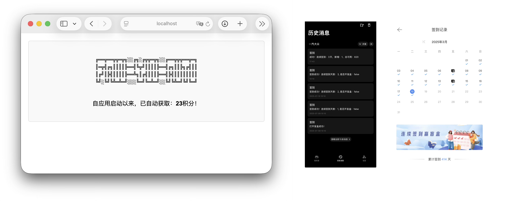

<div>
    
</div>

# faw-vw-auto
一汽大众自动定时签到获取积分，Release版本只编译了macOS（M系列芯片）环境的程序包，其他平台可自行下载编译。
<div>
    
</div>

## 有哪些功能
- 每日签到
- 连续签到7天，自动打开盲盒奖励；获取额外积分
- 支持Bark推送签到结果至iPhone
- 支持Docker容器运行

## 如何使用
无论使用哪种平台运行，均需配置 `env.yaml` 文件存储账号和签到参数。  
配置文件参数说明：

| 参数名               | 说明                                                                                     | 是否必填 |示例|
|----------------------|----------------------------------------------------------------------------------------|----------|----------|
| `mobile`             | 一汽大众APP注册手机号                                                                   | ✅ 必填   | 13012345678 |
| `password`           | 密码密文（需通过浏览器登录Web版，查看`https://vw.faw-vw.com/api/business/cpoint/registeOrLogin` 获取 Request Body 中的密文） | ✅ 必填   | a1b2c3d4e5f6... |
| `WebDid`             | 设备ID（同上，获取 Request Body 中的 `did` 参数）                                    | ✅ 必填   | Safari 18.2_528ssssss_Mac OS X ｜
| `BarkPushServerURL`  | Bark推送地址（用于iPhone签到结果推送，不需要可留空）                                     | ❌ 可选   | https://api.day.app/yourkey |
| `securityCode`       | 客户端签到接口必填参数（抓包App登录接口 `https://oneapp-api.faw-vw.com/account/login/loginByPassword/v1` 获取） | ✅ 必填   | 7a8b9c0d1e2f... |
| `did`                | 客户端设备ID（抓包同上接口获取）                                                        | ✅ 必填   | VW_APP_iPhone_XXXXXXXXXXXXXXXXXXXX_15.1_4.0.18 | 


---

#### Docker环境
1. **安装Docker**  
   - 确保已安装Docker，具体安装请参考 [Docker官方文档](https://docs.docker.com/get-docker/)。
2. **运行容器**
   - 使用以下命令拉取并运行容器：
    ```bash
    docker run -d \
    -v /your/local/path/env.yaml:/app/env.yaml \  # 挂载配置文件
    hytaoist/faw_vw_auto:latest # 将 /your/local/path/env.yaml 替换为本地配置文件实际路径。
    ```

#### macOS（M系列芯片）
1. **下载程序**  
   - 从 [Release页面](https://github.com/hytaoist/faw-vw-auto/releases) 下载最新版 `faw_vw_auto_darwin`，解压至任意目录。
2. **配置环境**  
   - 编辑同目录下的 `env.yaml` 文件，填写上述参数。
3. **运行程序**  
   ```bash
   nohup ./faw_vw_auto_darwin &  # 后台运行


## 注意事项‼️‼️‼️
- 本项目仅供学习交流使用，请勿用于商业用途。
- 因涉及账户密码，请勿将env.yaml文件上传至公共仓库，以免泄露个人信息。